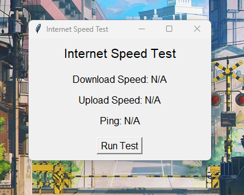
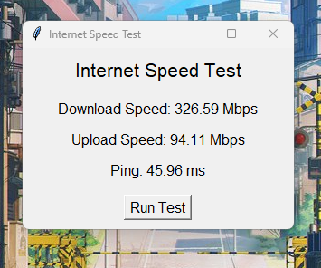

# Internet Speed Test GUI

This is a simple Python-based Internet Speed Test application with a graphical user interface (GUI) built using `Tkinter` and `speedtest-cli`. It allows users to measure their internet connection's download speed, upload speed, and ping.

## Features

-   Measures **Download Speed** in Mbps.
-   Measures **Upload Speed** in Mbps.
-   Displays **Ping** in milliseconds (ms).
-   Simple and clean GUI using `Tkinter`.
-   Standalone application without needing a web browser or external tools.

## Project Structure

`project-folder/

    engine.py               # Contains the logic to run the speed test
    user_interface.py        # Contains the GUI for interacting with the user
    README.md                # Project documentation` 

## Requirements

-   Python 3.x
-   `speedtest-cli` package
-   `Tkinter` (usually comes pre-installed with Python)

## Installation

1.  **Clone the repository** (or download the project files):
    
    `git clone https://github.com/vt24vikrant/Speed-Test.git
    cd Speed-Test` 
    
2.  **Install required dependencies**: Install `speedtest-cli` using `pip`:
    
    `pip install speedtest-cli` 
    

## Running the Application

1.  Open Command Prompt (cmd) or terminal.
2.  Run the application by executing:
    
    
    `python "file_directory\user_interface.py"` 
    
    Replace `file_directory` with the path to your `user_interface.py` file. For example:
    
    `python "V:\python proj\Speed Test\user_interface.py"` 

## Screenshots

Here are some screenshots of the application:

### Main Window

### Results Window

    

## How to Use

1.  Launch the application by running the above command.
2.  Click on the "Run Test" button.
3.  Wait for the results to display. The app will show:
    -   Download Speed in Mbps.
    -   Upload Speed in Mbps.
    -   Ping in milliseconds.

## Troubleshooting

-   Ensure Python 3.x is installed and added to the PATH.
-   Ensure all required packages are installed by running `pip install speedtest-cli`.